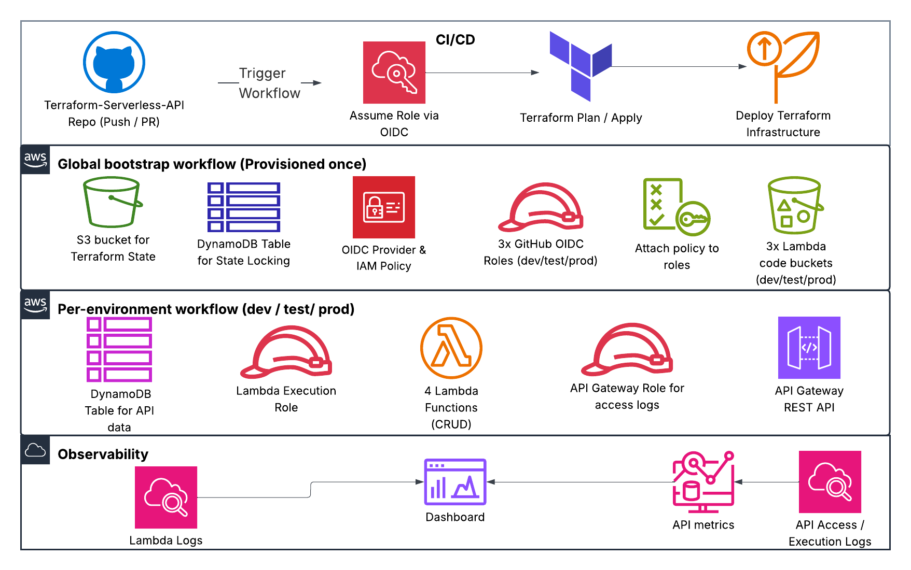

# Architecture

## 1. Overview

This project implements a Serverless REST API on AWS using Terraform for Infrastructure as Code (IaC) and GitHub Actions for CI/CD automation with OIDC authentication. The API supports full CRUD operations and demonstrates a multi-environment, least privilege, production grade cloud architecture.

## 2. Infrastructure components

### API Gateway – Public Entry Point

- Exposes REST API endpoints for Create, Read, Update, and Delete operations
- Integrated with Lambda functions via AWS Proxy integration

### Lambda – Serverless Compute

- Stateless functions handle incoming API requests and interact with DynamoDB
- Written in Node.js (Python planned for next implentation)
- Uses environment variables for dynamic configuration (DynamoDB table name)
- Integrated with CloudWatch for log monitoring and performance insights

### DynamoDB – NoSQL database

- Stores persistent application data for the API
- Separate table for Terraform state locking
- Configured for on demand billing in dev/test and autoscaling in production
- Designed for scalability, low latency, and high availability

### S3 - Object Storage

- Stores Terraform remote state files (terraform.tfstate)
- Versioning enabled to preserve infrastructure history and recovery
- Also used to store Lambda source code artifacts per environment

### IAM - Roles, Policies and OIDC

- Implements least privilege access for Lambda and API Gateway
- Uses GitHub OIDC provider for CI/CD authentication — eliminating static AWS credentials
- Defines scoped execution roles for each environment (dev, test, prod)
- Bootstrap workflow creates global IAM policies and OIDC trust relationships

### Terraform Backend

- Remote backend configured with S3 (state storage) and DynamoDB (state locking)
- SSM Parameter Store holds backend configuration values
- Ensures team collaboration, drift detection, and reproducible deployments

### CI/CD – GitHub Actions

- Automates all provisioning, validation, and deployment steps.
- Uses OIDC role assumption for secure, temporary AWS access.
- Structured for environment isolation:
  - global-infra → bootstraps foundational backend
  - dev → deploys dev
  - test → deploys test
  - main → deploys production
- Enforces approval review for production and auto apply for lower environments.

## 3. Requirements

### Functional

- Expose CRUD REST API endpoints through API Gateway
- Handle requests via Lambda functions integrated with DynamoDB
- Secure deployments and resource access using scoped IAM roles
- Support multiple isolated environments (dev, test, prod)

### Non-functional

- **Security**: OIDC authentication for CI/CD; IAM least privilege model
- **Observability**: CloudWatch logs, metrics, and dashboards
- **Scalability**: DynamoDB autoscaling and serverless compute elasticity
- **Cost Efficiency**: Pay-per-request model for Lambda, API Gateway, and DynamoDB
- **Reproducibility**: Terraform IaC ensures consistent provisioning across environments

## 4. High-Level Architecture

### Request Flow:

1. Client sends an HTTP request to API Gateway
2. API Gateway routes the request to the appropriate Lambda function
3. Lambda executes application logic and interacts with DynamoDB for data operations
4. GitHub Actions CI/CD pipeline provisions and updates infrastructure via Terraform
5. Terraform state is stored in S3 with state locking in DynamoDB

## 5. CI/CD Workflow

**Trigger**:

- On push or pull request to environment branches (dev, test, main, global-infra).

**Steps**:

1. Lint, format, and validate Terraform code
2. Run Jest unit tests for Lambda functions
3. Fetch backend configuration from AWS SSM Parameter Store
4. Execute terraform plan for pre-deployment preview
5. Execute terraform apply to deploy infrastructure to AWS

**Security**:

- GitHub Actions authenticates using OIDC — no static AWS keys
- Each environment assumes its own scoped IAM role for least privilege execution

### Deployment Governance

- **Branch-to-environment mapping:**

  - `global-infra` → bootstrap infrastructure
  - `dev` → development environment
  - `test` → staging environment
  - `main` → production environment

- **Approval workflow:**

  - Deployments to `global-infra` and `main` require manual approval via GitHub environment protection rules
  - Deployments to `dev` and `test` auto apply on push for faster iteration

- **Purpose:**  
  This ensures that foundational or production changes cannot be deployed without peer review, maintaining both security and change management discipline in line with DevSecOps best practices.

## 6. Infrastucture as Code - Terraform

**Modules**:

- api_gateway/ - API definitions, resources, and integrations
- lambda/ – Function configuration, permissions, and deployment packaging
- dynamodb/ - Tables for both app data and Terraform state locking
- iam/ - Roles, policies, and OIDC trust setup
- s3/ - Buckets for Terraform backend and Lambda source code

**Backend Config**:

- S3 → Remote state file storage (terraform.tfstate)
- DynamoDB → State file locking for concurrency safety
- SSM Parameter Store → Centralized backend configuration storage

## 7. Security Considerations

- All IAM roles adhere to least privilege principles
- CI/CD uses OIDC to avoid long lived AWS credentials
- Environment isolation via GitHub environments and separate Terraform state backends
- CloudWatch logging enabled for API Gateway and Lambda for auditing
- Regular IAM policy reviews and rotation recommended

## 8. Observability

- CloudWatch Logs capture Lambda and API Gateway activity
- CloudWatch Metrics monitor DynamoDB throughput and Lambda performance
- CloudWatch Dashboards visualize application health and latency
- Logging retention tuned per environment (7–14 days)

## 9. Cost Optimization

| Service             | Optimization                               | Notes                                                     |
| ------------------- | ------------------------------------------ | --------------------------------------------------------- |
| **API Gateway**     | REST API with throttling + stage isolation | More features; could migrate to HTTP API for cost savings |
| **Lambda**          | Memory tuning + CloudWatch insights        | On demand compute for duration based cost efficiency      |
| **DynamoDB**        | On demand billing for dev/test             | Autoscaling enabled for prod                              |
| **CloudWatch Logs** | Retention between 7–14 days                | Prevents unnecessary log storage costs                    |

## 10. Future Improvements

- Add authentication/authorization (Cognito or JWT)
- Integrate API Gateway with custom domain and ACM certificate
- Implement detailed alerting via CloudWatch Alarms + SNS
- Integrate Infracost for real time cost estimation
- Expand ADR coverage for observability and cost management
- Extend CI/CD pipeline for Terraform drift detection and reporting
